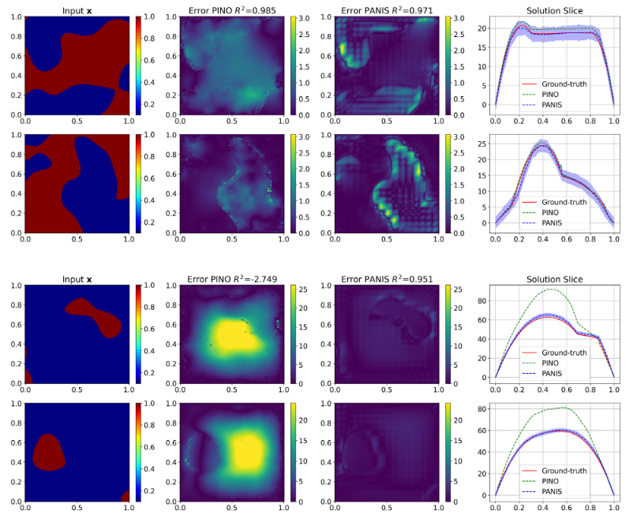

# Physics-Aware Neural Implicit Solvers for multiscale, parametric PDEs with applications in heterogeneous media



**Physics-Aware Neural Implicit Solvers for multiscale, parametric PDEs with applications in heterogeneous media**

Abstract: *We propose Physics-Aware Neural Implicit Solvers (PANIS), a novel, data-driven framework
for learning surrogates for parametrized Partial Differential Equations (PDEs). It consists of
a probabilistic, learning objective in which weighted residuals are used to probe the PDE
and provide a source of virtual data i.e. the actual PDE never needs to be solved. This is
combined with a physics-aware implicit solver that consists of a much coarser, discretized
version of the original PDE, which provides the requisite information bottleneck for high-
dimensional problems and enables generalization in out-of-distribution settings (e.g. different
boundary conditions). We demonstrate its capability in the context of random heterogeneous
materials where the input parameters represent the material microstructure. We extend the
framework to multiscale problems and show that a surrogate can be learned for the effective
(homogenized) solution without ever solving the reference problem. We further demonstrate
how the proposed framework can accommodate and generalize several existing learning
objectives and architectures while yielding probabilistic surrogates that can quantify predictive
uncertainty.*
## Dependences
-  Fenics 2019.1.0 (It is recommended to install this first and the rest of the dependences by using pip to avoid conflicts)
-  torch with cuda 12.1 (pip install torch==2.4.0 torchvision==0.19.0 torchaudio==2.4.0 --index-url https://download.pytorch.org/whl/cu121)
-  scipy-1.14.1
-  matplotlib 3.9.2
-  pandas 2.2.2

## Installation
- Install Matlab 2018b, python 3.12.2 and all dependencies mentioned above.
- To clone this repo:
```
git clone ...
cd PANIS
```

## Data Description
- Before running the code, to extract some indicative validation data execute:
```
cd ./Datasets
cat Datasets.tar.gz.part_* > ../Datasets.tar.gz
cd ..
tar -xzf Datasets.tar.gz
```
- at ./Datasets/ you will find four folders, which contain the labeled data used for training or validating the models. PANIS, mPANIS or nPANIS don't use these data for training but only for validation.
- at ./pino_comparison_data you will find the results of PINO for the respective datasets.
- at ./utils/trainedNNs you will find pretrained PANIS, mPANIs, nPANIS models for out-of-distribution predictions or other tests.

## How to Run
Depending on the model you want to run (PANIS or mPANIS or nPANIS) just select the respective input file and replace the existing one (input.py). Execute the main.py and the code will train and give predictions in the end. Some plots will be created too. In the current form, 24 GB of GPU memory are required to run, but you can proportionaly decrease the memory needs by reducing the "Nx_samp" parameter. The code model will be trained successfully as before but it will require proportionally more SVI iterations to converge.

## Citation
If this code is relevant for your research, we would be grateful if you cite our work:
```
@article{CHATZOPOULOS2024117342,
title = {Physics-Aware Neural Implicit Solvers for multiscale, parametric PDEs with applications in heterogeneous media},
journal = {Computer Methods in Applied Mechanics and Engineering},
volume = {432},
pages = {117342},
year = {2024},
issn = {0045-7825},
doi = {https://doi.org/10.1016/j.cma.2024.117342},
url = {https://www.sciencedirect.com/science/article/pii/S0045782524005978},
author = {Matthaios Chatzopoulos and Phaedon-Stelios Koutsourelakis},
keywords = {Random heterogeneous materials, Data-driven, Probabilistic surrogate, Deep learning, Machine learning, High-dimensional surrogates, Virtual observables},
abstract = {We propose Physics-Aware Neural Implicit Solvers (PANIS), a novel, data-driven framework for learning surrogates for parametrized Partial Differential Equations (PDEs). It consists of a probabilistic, learning objective in which weighted residuals are used to probe the PDE and provide a source of virtual data i.e. the actual PDE never needs to be solved. This is combined with a physics-aware implicit solver that consists of a much coarser, discretized version of the original PDE, which provides the requisite information bottleneck for high-dimensional problems and enables generalization in out-of-distribution settings (e.g. different boundary conditions). We demonstrate its capability in the context of random heterogeneous materials where the input parameters represent the material microstructure. We extend the framework to multiscale problems and show that a surrogate can be learned for the effective (homogenized) solution without ever solving the reference problem. We further demonstrate how the proposed framework can accommodate and generalize several existing learning objectives and architectures while yielding probabilistic surrogates that can quantify predictive uncertainty.}
}
```
